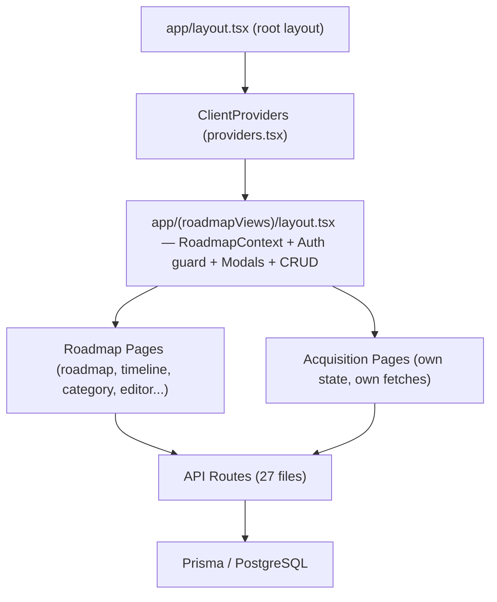

# Roadmap App — Code Quality Review

> Generated: March 2026  
> Purpose: Track incremental cleanup and standardization work. Complete groups in order — each group is committed separately for easy rollback.

---

## Architecture at a Glance

---

## Group 1 — Safe Removals (Zero Risk)

Dead files or exact duplicates. Deleting them changes nothing functional.

- [x] **1.1** Delete `src/components/ui/` — `button.tsx`, `badge.tsx`, `card.tsx` are exact duplicates of `components/ui/`. Nothing imports from `src/`.
- [x] **1.2** Delete `hooks/use-mobile.tsx` — duplicate of `components/ui/use-mobile.tsx`. Fixed `components/ui/sidebar.tsx` import first.
- [x] **1.3** Remove local `getStatusColor()`, `getCategoryColor()`, `formatDate()` from `components/roadmap-timeline.tsx` and `components/RoadmapView.tsx` — identical to canonical versions in `lib/utils/formatters.ts`. Replaced with import.

---

## Group 2 — Standardization (Low Risk)

Consistent patterns applied uniformly. Each is a small, targeted change.

- [x] **2.1** Create `lib/constants/roadmap.ts` with `categories` and `statuses` arrays. Replace 5+ duplicate inline definitions in `roadmap-timeline.tsx`, `RoadmapView.tsx`, `item-form.tsx`, `editor-view-table.tsx`, and `layout.tsx`.
- [x] **2.2** Convert dynamic `getServerSession` imports to static in acquisition, project, and sub-resource API routes. (~10 files)
- [x] **2.3** Standardize DELETE responses to `204 No Content` across all API routes. Currently mixed between 204 and `200 { message }`.
- [x] **2.4** Replace `window.confirm()` with `<AlertDialog>` across all 5 files that used it (timeline, editor, acquisitions, technical-integration, milestone-management-modal). Also added missing confirmation to roadmap/page.tsx.
- [x] **2.5** Add brand color tokens to `tailwind.config.ts` (`brand-navy`, `brand-light`, `brand-metric`). Replace 12+ hardcoded `rgb(2_33_77)` strings across components.
- [ ] **2.6** *(Optional UX)* Add `toast.success()` calls on successful CRUD — `sonner` is installed and `<Toaster>` is mounted but never called.

---

## Group 3 — Duplicate Logic (Medium Risk, High Value)

These require more care but have the highest maintenance payoff.

- [ ] **3.1** Audit `app/api/milestones-clean/` routes — near-duplicate of `app/api/roadmap/milestones/`. Determine which UI flows call which, redirect, and remove the duplicate set.
- [ ] **3.2** Create `buildUpdateData(body, allowedFields)` helper in `lib/utils/` — replace the copy-pasted partial update builder in 8+ PATCH handlers.
- [ ] **3.3** Create `requireEditorSession()` helper in `lib/auth.ts` — replace the verbatim auth+role check block in ~15 API routes.
- [ ] **3.4** Extract `<RoadmapItemCard>` component — same JSX (status dot, title, link, metrics, editor dropdown) is copy-pasted across 5 files: `roadmap-timeline.tsx` (×2), `RoadmapView.tsx`, `roadmap/page.tsx`, `timeline/page.tsx`.
- [ ] **3.5** Extract `<MetricBadgeGroup label metrics />` component — the pirate/north-star badge group pattern appears 8+ times.
- [ ] **3.6** Extract `<RelevantLinksEditor>` component — duplicated identically in `item-form.tsx` and `project-form.tsx`.
- [ ] **3.7** Extract `<MultiSelectCombobox>` component — the `<Popover><Command>` multi-select pattern appears 3× in `item-form.tsx` and 1× in `project-form.tsx`.
- [ ] **3.8** Extract `<DispositionBadge disposition />` component — color-coded badge logic duplicated in `acquisitions/page.tsx` and `acquisition-tracker/page.tsx`.

---

## Group 4 — Structural Concerns (Awareness Only — Plan Separately)

Higher effort, requires dedicated planning before touching.

- [ ] **4.1** Split `app/(roadmapViews)/layout.tsx` (~652 lines) — currently a god file acting as Next.js layout, React Context provider, data fetching layer, modal state manager, auth guard, and sidebar. Extract `RoadmapProvider` to its own file.
- [ ] **4.2** Retire `components/roadmap-timeline.tsx` — contains 4 internal render functions (`renderTimelineView`, `renderCategoryView`, `renderEditorView`, `renderHorizontalRoadmapView`). Migration to page-based architecture already started under `app/(roadmapViews)/`.
- [ ] **4.3** Add shared acquisition state — `acquisitions` is fetched independently by 3+ pages. Consider an `AcquisitionContext` or `useAcquisitions()` hook similar to `RoadmapContext`.
- [ ] **4.4** Consolidate `providers.tsx` and `client-providers.tsx` — both wrap `SessionProvider` + `AuthProvider`. Not harmful but redundant nesting.
- [ ] **4.5** Migrate `relevantLinks` data format — field handles both old `string` format and new `{ url, text }` object format via inline type guards. A one-time data migration would let the guards be removed.

---

## Test Plans

### Group 1 — Post-Deploy Checklist ✅ (completed)

- [x] Sidebar opens, closes, and collapses correctly
- [x] Status dots (green/amber/slate) appear on roadmap items in all views
- [x] Category color bars appear for all 5 categories: Product (blue), AI (green), Integrations (orange), Branding (purple), Migrations (grey)
- [x] No console errors on any page

---

### Group 2 — Post-Deploy Checklist

**2.1 — Constants file (categories/statuses)**
- [x] Category dropdown in the item create form shows all 5 categories: Product, AI, Integrations, Branding, Migrations
- [x] Category dropdown in the item edit form shows all 5 categories
- [x] Status dropdown shows all expected statuses (planned, in-progress, completed)
- [x] Category filter in the sidebar/toolbar works and filters correctly
- [x] Category color bars still render correctly in all views after the constant is centralized
- [x] Editor table view shows correct category labels

**2.2 — Static auth imports (API routes)**
- [x] As an **editor**, create a new acquisition → should succeed
- [x] As an **editor**, edit an existing acquisition → should succeed
- [x] As an **editor**, delete an acquisition → should succeed
- [x] As an **editor**, create/edit/delete a project → should succeed
- [x] As a **viewer**, attempt to create an acquisition → should silently fail or show an error (no 500)
- [x] Acquisition progress updates save correctly
- [x] Functionality epics can be created and deleted
- [x] No change in behavior — this is purely an import style fix; if auth worked before it should work identically after

**2.3 — DELETE responses standardized to 204**
- [x] Delete a roadmap item from the timeline view → item disappears from the list, no error toast
- [x] Delete a roadmap item from the roadmap (card) view → same
- [x] Delete a milestone (with no items attached) → milestone disappears, no error
- [x] Delete an acquisition → removed from list
- [x] Delete a project → removed from list
- [x] Delete a functionality epic → removed from the epic list
- [x] ⚠️ **Key thing to watch**: any delete that previously worked should still work — if any client-side code was reading the response body of a delete, it would now get `null` and could break silently

**2.4 — AlertDialog replaces window.confirm() on timeline page**
- [x] On the **Timeline page**, click the delete button on a roadmap item
- [x] Confirm an **in-app dialog** (styled, matching the rest of the app) appears — NOT a browser native popup
- [x] Click **Cancel** in the dialog → item is NOT deleted, dialog closes
- [x] Click **Confirm/Delete** in the dialog → item IS deleted and removed from the view
- [x] Verify this matches the delete confirmation behavior on the **Roadmap (card) view** for visual consistency

**2.5 — Tailwind brand color tokens**
- [x] All page headers that use the navy brand color (`rgb(2 33 77)`) render correctly in **light mode**
- [x] Same headers render correctly in **dark mode**
- [ ] Metric badges (pirate metrics, north star metrics) retain their grey color (`rgb(211 220 230)`)
- [x] Light blue-grey backgrounds (`rgb(240 244 249)`) still appear on section headers
- [x] Category color bars still correct (these use different colors, but confirm no regression)
- [x] ⚠️ **Specific pages to check**: Roadmap view, Timeline view, Category view, Acquisition Tracker, Technical Integration page

---

## Execution Notes

- Each group should be a **single commit** for easy rollback
- Groups 1 → 2 → 3 → 4 in order (each builds on the last)
- Group 4 items should each be planned individually before execution
